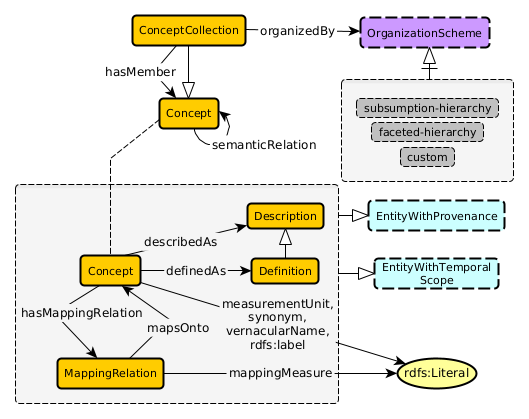

# Scientific-Taxonomy-Pattern
An Ontology Design Pattern for Representing Scientific Taxonomies

## Schema Diagram

## [Formalization](./scientific-taxonomy-pattern.owl)

## Usage
If you use this pattern academically, we kindly ask that you cite our canonical paper, located in the publications folder. 